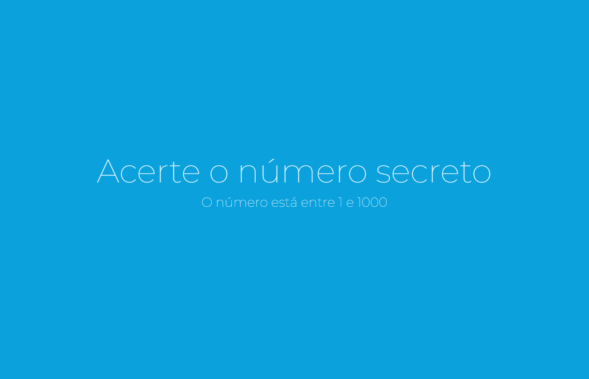
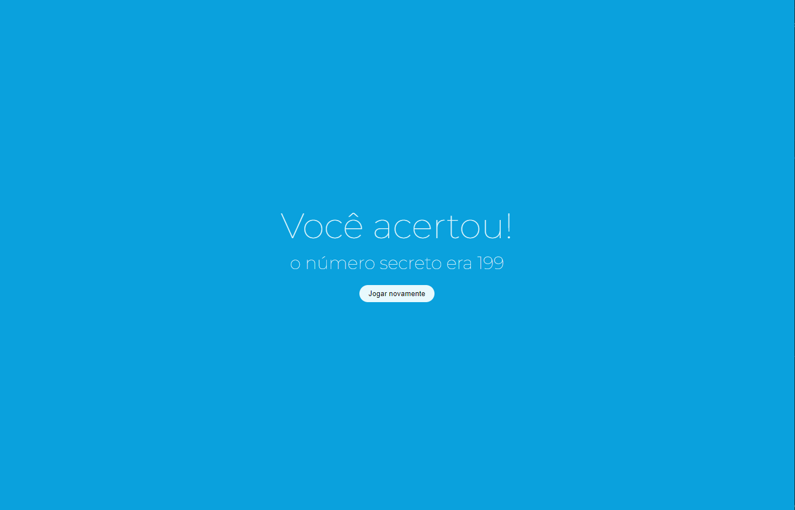
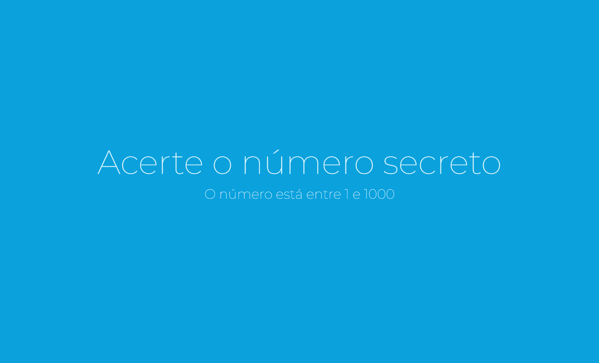

# Número Secreto

  Projeto desenvolvido duranto o curso JavaScript: validações e reconhecimento de voz da Alura.

O projeto utiliza o <a href="https://developer.mozilla.org/en-US/docs/Web/API/Web_Speech_API">Web Speech API</a> para captar a voz do usuário.

Página Inicial:

Página de acerto:

Projeto funcionando:

## Tecnologias

- HMTL
- CSS
- JavaScript

## Deployment

  Link to the page: 
  <a href="https://secret-number-phi.vercel.app/" rel="noopener noreferrer" target="_blank">Número Secreto</a>

